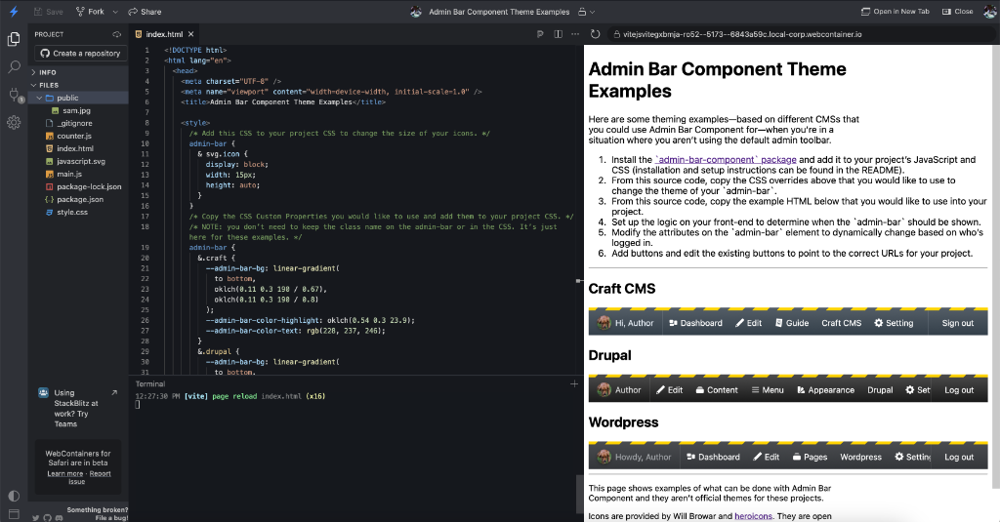

# Admin Bar Component


Admin Bar Component is a web component that is built with [Lit](https://lit.dev). It can be added to projects that can load web components (vanilla JavaScript and most modern frameworks) and it is customizable so you can choose what buttons are displayed, and you can style it to match your brand or website’s look and feel.

- 👋 Show an avatar and a greeting to confirm the currently logged-in user.
- 🚧 A customizable environment warning can be shown to let users know they are not on production.
- 🎛️ Buttons are customizable and can link to a URL, trigger JavaScript events, or show extra content in an HTML popover.
- 2️⃣ Text elements can be added to provide stats and small notes to authors.
- ✅ Checkbox elements can be used to toggle settings.
- 📐 A progress bar can show successful or failed AJAX requests.
- 🚪 A dedicated logout button gives users a way to sign out of your app.

## Installation

To install Admin Bar Component, use NPM or a compatible package manager.

### With NPM:

```bash
npm install admin-bar-component --save-dev
```

## Setup

Admin Bar can be set up manually or by using a built-in helper method.

### Manual Setup

To add Admin Bar to your project, import it in as an ES module, then define it as a custom element:

```javascript
import { AdminBar, AdminBarButton, AdminBarCheckbox, AdminBarText } from 'admin-bar-component'

// Define Admin Bar element.
customElements.define('admin-bar', AdminBar)

// Define Admin Bar subcomponents based on what you need in your project..
customElements.define('admin-bar-button', AdminBarButton)
customElements.define('admin-bar-checkbox', AdminBarCheckbox)
customElements.define('admin-bar-text', AdminBarText)
```

### Helper Setup

The `defineAdminBarElements` helper method will automatically define Admin Bar as a custom element, then define any subcomponents defined in its arguments:

```javascript
import { defineAdminBarElements } from 'admin-bar-component'

// Defines `<admin-bar>`, `<admin-bar-button>`, `<admin-bar-checkbox>`, and `<admin-bar-text>` elements.
defineAdminBarElements(['button', 'checkbox', 'text'])
```

### Setup Examples



- [CodePen – Basic Usage](https://codepen.io/wbrowar/pen/PwYPEEj)
- [CodePen – Kitchen Sink](https://codepen.io/wbrowar/pen/MYgavqL)
- [Stackblitz – Theme Examples](https://stackblitz.com/edit/vitejs-vite-gxbmja?file=index.html)
- [Stackblitz – Vite + Vanilla JS](https://stackblitz.com/edit/vitejs-vite-ckpby6?file=index.html)
- [Stackblitz – Vite + Vue.js 3](https://stackblitz.com/edit/vitejs-vite-gb3byy?file=vite.config.js)

### To add Admin Bar Component to an HTML page, follow these instructions:

1. Add the stylesheet in your `<head>` tag:
   ```html
   <link rel="stylesheet" href="path-to-your-assets/admin-bar.css" />
   ```
1. Add the JavaScript file wherever you load your scripts:
   ```html
   <script type="module" src="path-to-your-assets/admin-bar.js"></script>
   ```
1. Import and define Admin Bar Component’s custom elements:
   ```javascript
   <script type="module">
     import { defineAdminBarElements } from 'admin-bar-component'
     
     // Define `<admin-bar>` and subcomponents as custom elements.
     defineAdminBarElements(['button', 'checkbox', 'text'])
   </script>
   ```
1. Add and configure an `<admin-bar>` element:
   ```html
   <admin-bar></admin-bar>
   ```
1. Add buttons into your `<admin-bar>` element:
   ```html
   <admin-bar>
     <admin-bar-button></admin-bar-button>
   </admin-bar>
   ```

### To add Admin Bar Component to a project with a build tool, like Vite, follow these instructions:

1. In a global JavaScript file or in a specific layout or component file, you can import the JavaScript file like this:
   ```javascript
   import { defineAdminBarElements } from 'admin-bar-component'
   
   // Define `<admin-bar>` and subcomponents as custom elements.
   defineAdminBarElements(['button', 'checkbox', 'text'])
   ```
1. You can load the CSS in your component file, as well, by importing the file directly:
   ```javascript
   import { defineAdminBarElements } from 'admin-bar-component'
   import 'admin-bar-component/dist/admin-bar.css'
   
   // Define `<admin-bar>` and subcomponents as custom elements.
   defineAdminBarElements(['button', 'checkbox', 'text'])
   ```
   Or, if you are using something like PostCSS, you can import the CSS file into your CSS file, like this:
   ```postcss
   @import url(admin-bar-component/dist/admin-bar.css);
   ```

Depending on what bundler or framework you are using, you may need to add loaders or register the web component as a custom element (telling the framework not to try to render it).

## Customizing Admin Bar

All of the features on the `<admin-bar>` element are opt-in by using attributes and slots.

For example, you can add a greeting message by adding the `show-greeting` attribute:
```html
<admin-bar show-greeting></admin-bar>
```

By default, this will show a pencil icon, but you can add a custom message by adding text into the `greeting-text` prop or an element into the `greeting` slot:
```html
<admin-bar show-greeting>
  <div slot="greeting">Hello, Sam</div>
</admin-bar>
```

Now your custom text will appear. If you would also like to add an avatar next to your message, you can use the `avatar-src` and `avatar-alt` attributes:
```html
<admin-bar show-greeting avatar-src="path-to-your-assets/user-photo.jpg" avatar-alt="Sam’s avatar">
  <div slot="greeting">Hello, Sam</div>
</admin-bar>
```

> [!NOTE]
> If `show-greeting` is removed, the avatar image and the content in the `greeting` slot will no longer be rendered.

## Displaying Admin Bar on Thinner Screens and Mobile Devices

Admin Bar is a horizontal bar that scrolls horizontally by default. On mobile devices, or if you prefer Admin Bar to appear as a vertical column, you can enable vertical mode using a boolean CSS variable, called `--admin-bar-vertical`.

To turn on vertical mode, you can add the `vertical` class to `<admin-bar>` and this will enable vertical mode based on a media query.

If you prefer to use vertical mode in another scenario, you can set `--admin-bar-vertical: true;` in your CSS and it will always be in vertical mode. Or you can create a media query that sets `--admin-bar-vertical: true;` at a specific breakpoint.

> [!NOTE]
> Using `--admin-bar-vertical: true;` is only supported in browser that support CSS `@container style()` queries.


### Collapsing and Expanding Admin Bar

Buttons can be added to the `<admin-bar>` element to toggle between the full Admin Bar toolbar and a collapsed version that gets out of the way of the page content. To add the toggle button, add the `toolbar-toggle` attribute to the `<admin-bar>` element.

```html
<!-- Displays the full toolbar along with a toggle button. -->
<admin-bar toggle-toolbar="toolbar"></admin-bar>
```

Setting `toggle-toolbar="toolbar"` will display the full toolbar and a button that users may use to collapse the toolbar. Clicking the collapse button will change the state of the `toolbar-toggle` attribute and replace the toolbar with a button:

```html
<!-- Displays a button. -->
<admin-bar toggle-toolbar="button"></admin-bar>
```

#### Automatically Switching Between Vertical and Horizonal Mode

Add the `auto-toggle-vertical` attribute will automatically switch between the full toolbar and a collapsed version of the toolbar based on the screen width. The collapsed version will allow you to toggle between the toggle button and the vertical toolbar.

```html
<!-- Displays a button. -->
<admin-bar auto-toggle-vertical></admin-bar>
```

#### Dragging the Collapsed Toolbar Button

Adding the `toolbar-toggle-drag` attribute allows users to drag the collapsed toolbar button to another location on the page when Admin Bar is in the collapsed state.

```html
<!-- Displays a button. -->
<admin-bar auto-toggle-vertical toolbar-toggle-drag></admin-bar>
```

## Using Admin Bar to Show Progress

When using Admin Bar to make AJAX requests, you can show the progress and resolution of the request using Admin Bar as a visual progress bar. Setting the `progress` attribute to a number other than `0` will display a progress bar using a percentage from `0` to `100`.

Accepted values:
- `0-99` displays a blue progress bar where the blue is a percentage of the full Admin Bar element.
- `100` (or above) displays a green progress bar that indicates that the request has completed successfully.
- `-1` (or below) displays a red progress bar that indicates that the request has failed.

The colors and the height of the progress bar can be customized using CSS Custom Properties. When the hight is changed, the progress bar will align to the bottom of Admin Bar.

### Admin Bar Public Properties

| Attribute Name                           | Type      | Default                                                              | Description                                                                                           |
|------------------------------------------|-----------|----------------------------------------------------------------------|-------------------------------------------------------------------------------------------------------|
| `auto-toggle-vertical`                   | _boolean_ | `false`                                                              | Automatically toggles between toolbar and button when resized.                                        |
| `avatar-alt`                             | _string_  | `'Avatar of logged in user.'`                                        | Sets the alt text on an avatar image.                                                                 |
| `avatar-src`                             | _string_  | `undefined`                                                          | Sets the `src` on an avatar image and enables the avatar image to be displayed.                       |
| `environment-description`                | _string_  | `undefined`                                                          | Sets visually hidden text that explains the reason why the environment warning is displayed.          |
| `greeting-text`                          | _string_  | `undefined`                                                          | Sets the greeting text content.                                                                       |
| `logout-href`                            | _string_  | `'#'`                                                                | A URL added to the default logout button, when `show-logout` is added to an `<admin-bar>`.            |
| `logout-label`                           | _string_  | `'Sign out'`                                                         | The label of the default logout button.                                                               |
| `progress`                               | _number_  | `0`                                                                  | Displays a visual progress bar based on the number `progress` is set to.                              |
| `show-environment`                       | _boolean_ | `false`                                                              | Displays the environment warning, letting users know what environment they are currently logged into. |
| `show-greeting`                          | _boolean_ | `false`                                                              | Displays the avatar and greeting message.                                                             |
| `show-logout`                            | _boolean_ | `false`                                                              | Displays the default logout button or content added to the `logout` slot.                             |
| `toolbar-toggle`                         | _string_  | `'toolbar'`                                                          | Displays the toggle button that toggles the display of Admin Bar.                                     |
| `toolbar-toggle-drag`                    | _string_  | `'reset'`                                                            | Adds a drag handle to the toggle button that lets users reposition it when needed.                    |
| `toolbar-toggle-drag-handle-description` | _string_  | `'Click to drag the toggle button to another position on the page.'` | Add a description to guide the user on how the drag handle works.                                     |
| `toolbar-toggle-inner-description`       | _string_  | `'Click to collapse toolbar.'`                                       | Add a description to guide the user on what will happen when the inner toggle button is clicked.      |
| `toolbar-toggle-outer-description`       | _string_  | `'Click to expand toolbar.'`                                         | Add a description to guide the user on what will happen when the outer toggle button is clicked.      |

### Admin Bar Slots

| Slot Name          | Description                                                                                                                                                                                                                                                               |
|--------------------|---------------------------------------------------------------------------------------------------------------------------------------------------------------------------------------------------------------------------------------------------------------------------|
| `default`          | The `default` slot is where you would place `<admin-bar-button>` elements, but it can also be used for other elements. All children in the `default` slot will be laid out by CSS Flexbox and the contents will horizontally scroll when it gets too wide.                |
| `greeting`         | This slot is meant to let the logged-in user verify they are logged in, but any HTML or text can appear in the `greeting` slot.                                                                                                                                           |
| `greeting-popover` | Turns the `greeting` slot into a button and displays this slot content in a popover.                                                                                                                                                                                      |
| `inner-toggle`     | Replace the collapse icon on the toolbar’s toggle button.                                                                                                                                                                                                                 |
| `logout`           | When `show-logout` is set, a default logout button will be rendered, using the `logout-href` and `logout-label` attributes. Adding elements into the `logout` slot will repace the default logout button, allowing you to use your own `<admin-bar-button>` in its place. |
| `outer-toggle`     | Replace the default pencil icon or greeting text on the toggle button when Admin Bar is collapsed.                                                                                                                                                                        |

---

## Customizing Add Admin Bar Buttons

Admin Bar Buttons are child web components that render either an `<a>` element or a `<button>` element—depending on the options you pass through.

To create an `<a>` element that links to a URL, you can add a label and a `button-href` attribute that includes your URL:
```html
<admin-bar-button button-href="https://myexample.com" label-text="My Link Label"></admin-bar-button>
```

To create a `<button>` element with JavaScript click event, you can leave off the `button-href` and the component will switch over to a button element:
```html
<admin-bar-button onclick="myEventHandlerMethod" label-text="My Button Label"></admin-bar-button>
```

To differentiate your buttons, `<svg>` or `` icons can be added to either the `before-label` or `after-label` slots:
```html
<admin-bar-button onclick="myEventHandlerMethod" label-text="My Button Label"><span slot="before-label"><svg <!-- SVG code --> ></svg></span></admin-bar-button>
```

## Adding Sub-Menus Using Admin Bar Button Popovers

Populating the `popover` slot will render the `popover` slot and add a matching `popovertarget` attribute to the `<admin-bar-button>`. Clicking on the `<admin-bar-button>` will open the popover. Clicking or focusing anywhere away from the popover content will hide the popover content again.

> [!NOTE]
> The `popover` slot content appears below its `<admin-bar-button>` on browsers that support [CSS Anchor Positioning](https://caniuse.com/css-anchor-positioning). Browsers that don’t support CSS Anchor Positioning yet will fall back to displaying the `popover` slot in the center of the screen (which is the default for HTML popover).

Any HTML can be added to the `popover` slot, but for consistency, you can use `<admin-bar-text>`, `<admin-bar-checkbox>`, and `<admin-bar-button>` elements. Here’s an example of what an `<admin-bar-text>` popover could look like:

```html
<admin-bar-button>
  Show Popover
  <span slot="popover">
    <admin-bar-text>Hi, this is popover content 🍾</admin-bar-text>
  </span>
</admin-bar-button>
```

The "Show Popover" text will appear as the label on the button, and "Hi, this is popover content 🍾" will appear in the popover when the button is clicked.

To create a secondary row of links, you can populate the `popover` slot with `<admin-bar-button>` elements:

```html
<admin-bar-button>
  Popover Slot 2
  <nav slot="popover">
   <admin-bar-button button-href="https://craftcms.com">Craft CMS</admin-bar-button>
   <admin-bar-button button-href="https://laravel.com">Laravel</admin-bar-button>
  </nav>
</admin-bar-button>
```

> [!NOTE]
> To make the links appear in a row, you can use CSS to style the `nav` element here to use `display: flex;`.

### Admin Bar Button Public Properties

| Attribute Name      | Type      | Default     | Description                                                                                                                  |
|---------------------|-----------|-------------|------------------------------------------------------------------------------------------------------------------------------|
| `button-aria-label` | _string_  | `''`        | Add an aria-label to the `button` or `a` element.                                                                            |
| `button-href`       | _string_  | `undefined` | Adding the `button-href` turns the `<admin-bar-button>` into an `<a>` elements and sets this string as its `href` attribute. |
| `label-text`        | _string_  | `''`        | Sets the label for the `<admin-bar-button>`.                                                                                 |
| `logout-button`     | _boolean_ | `false`     | Styles the button like the default logout button.                                                                            |

### Admin Bar Button Slots

| Slot Name      | Description                                                                    |
|----------------|--------------------------------------------------------------------------------|
| `after-label`  | Adds content after the label. This can be used for icons or other indicators.  |
| `before-label` | Adds content before the label. This can be used for icons or other indicators. |
| `default`      | Adding text or elements into the `default` slot replaces the `label-text`.     |
| `popover`      | Turns the button into a trigger and displays slot content in a popover.        |

### Admin Bar Button Events

| Event Name | Type                      | Payload                                                 | Description                                                                                                                                               |
|------------|---------------------------|---------------------------------------------------------|-----------------------------------------------------------------------------------------------------------------------------------------------------------|
| `click`    | MouseEvent                | `''`                                                    | A standard `click` event, bubbled up from the internal `<button>` element.                                                                                |
| `toggle`   | AdminBarButtonToggleEvent | `{ newState: string; oldState: string; open: boolean }` | An extended version of the popover `toggle` event that fires when the popover open state changes. Includes popover states and an `open` boolean property. |
| `opened`   | AdminBarButtonOpenedEvent | ``                                                      | Event that fires when the popover is toggled to the `open` state.                                                                                         |
| `closed`   | AdminBarButtonClosedEvent | ``                                                      | Event that fires when the popover is toggled to the `closed` state.                                                                                       |

### Replacing the Default Logout Button

You may have a situation where you need to replace the default logout button to—for example—a button that fires a JavaScript action. Starting with this code as an example, you can do the following:
```html
<admin-bar show-logout logout-href="/logout" logout-label="Log off"></admin-bar>
```

1. Add an `<admin-bar-button>` into the `default` slot of your `<admin-bar>`
   ```html
   <admin-bar show-logout logout-href="/logout" logout-label="Log off">
     <admin-bar-button></admin-bar-button>
   </admin-bar>
   ```
1. Add `slot="logout"` to the `<admin-bar-button>`. Add the `logout-button` attribute to style the button with the styles from the default logout button.
   ```html
   <admin-bar show-logout logout-href="/logout" logout-label="Log off">
     <admin-bar-button slot="logout" logout-button></admin-bar-button>
   </admin-bar>
   ```
1. If you are using vanilla JavaScript you can use an `onclick` attribute to fire your logout script on click. If you are using a compatible framework, you can change `onclick` to the syntax used to handle `click` events.
   ```html
   <admin-bar show-logout logout-href="/logout" logout-label="Log off">
     <admin-bar-button onclick="handleLogoutMethod" slot="logout" logout-button></admin-bar-button>
   </admin-bar>
   ```
1. This replaces the original logout buttons, so you no longer need the `logout-href` and `logout-label` attributes. You still need the `show-logout` attribute to render the logout slot.
   ```html
   <admin-bar show-logout>
     <admin-bar-button onclick="handleLogoutMethod" slot="logout" logout-button></admin-bar-button>
   </admin-bar>
   ```

---

## Adding Checkbox Inputs to Admin Bar

Admin Bar comes with a custom checkbox subcomponent that is a wrapper around an HTML checkbox `<input>` element. It includes events that fire when the state of the checkbox changes.

The way an `<admin-bar-checkbox>` is used is up to you. A simple example of how to use it can be to toggle a class on an HTML element:

1. To start, add an `<admin-bar>` with an `<admin-bar-checkbox>` child element:
   ```html
   <admin-bar>
    <admin-bar-checkbox label-text="Enable Dark Mode"></admin-bar-checkbox>
   </admin-bar>
   ```
1. You can then add an event listener to watch for the `change` event. The `change` event extends the normal input `change` event, and it includes a `checked` property that returns a boolean value.
   ```html
   <admin-bar>
    <admin-bar-checkbox label-text="Enable Dark Mode"></admin-bar-checkbox>
   </admin-bar>
   
   <script>
     const checkboxElement = document.querySelector('admin-bar-checkbox')
   
     if (checkboxElement) {
       checkboxElement.addEventListener('change', (e) => {
         if (e.checked) {
           // If the `checked` value is `true` add class to the body element.
           document.body.classList.add('dark-mode')
         } else {
           // If the `checked` value is `false` remove class from the body element.
           document.body.classList.remove('dark-mode')
         }
       })
     }
   </script>
   ```

Another pattern you could follow is to use the `<admin-bar-checkbox>` element to make changes to user setting through an API request:

```html
<admin-bar>
  <admin-bar-checkbox label-text="Enable Preference"></admin-bar-checkbox>
</admin-bar>

<script>
  const adminBarElement = document.querySelector('admin-bar')
  const checkboxElement = document.querySelector('admin-bar-checkbox')

  if (adminBarElement && checkboxElement) {
    checkboxElement.addEventListener('change', async (e) => {
      // Sets checkbox to disabled state to prevent user from interacting with it during API request.
      checkboxElement.setAttribute('disabled', '')

      // Sets admin bar `progress` value to `50` to indicate progress.
      adminBarElement.setAttribute('progress', '50')

      // Make API request
      try {
        // You can use the custom boolean property, `checked`, from the event to pass into your API request.
        // The `makeApiRequest` function is just an example.
        await makeApiRequest({ enable: e.checked })
        adminBarElement.setAttribute('progress', '100')
      } catch (error) {
        // Handle error ...

        // Set admin bar `progress` value to `-1` to indicate an error.
        adminBarElement.setAttribute('progress', '-1')
      } finally {
        // Enable checkbox again.
        checkboxElement.removeAttribute('disabled')
      }
    })
  }
</script>
```

### Admin Bar Checkbox Public Properties

| Attribute Name     | Type      | Default      | Description                                                                              |
|--------------------|-----------|--------------|------------------------------------------------------------------------------------------|
| `input-aria-label` | _string_  | `undefined`  | Add an aria-label to the `input` element.                                                |
| `checked`          | _boolean_ | `false`      | Sets the value of the checkbox.                                                          |
| `disabled`         | _boolean_ | `false`      | Disables the checkbox.                                                                   |
| `label-text`       | _string_  | `''`         | The label text content for the checkbox.                                                 |
| `input-name`       | _string_  | `'checkbox'` | The `name` attribute of the checkbox.                                                    |
| `input-switch`     | _boolean_ | `false`      | Setting this to `true` will add the `switch` attribute to the checkbox element.          |
| `label-position`   | _string_  | `'after'`    | Sets the position for the label in relation to the checkbox. Accepts: 'after', 'before'  |

### Admin Bar Checkbox Slots

| Slot Name        | Description                                                                                                                  |
|------------------|------------------------------------------------------------------------------------------------------------------------------|
| `checked-icon`   | Visually hides the browser checkbox element and shows custom HTML in its place when the `<admin-bar-checkbox>` is checked.   |
| `unchecked-icon` | Visually hides the browser checkbox element and shows custom HTML in its place when the `<admin-bar-checkbox>` is unchecked. |

### Admin Bar Checkbox Events

| Event Name  | Type                           | Payload                | Description                                                                                        |
|-------------|--------------------------------|------------------------|----------------------------------------------------------------------------------------------------|
| `change`    | AdminBarCheckboxChangeEvent    | `{ checked: boolean }` | An extended version of the input `change` event that fires when the state of the checkbox changes. |
| `checked`   | AdminBarCheckboxCheckedEvent   | ``                     | Event that fires when the input is changed to the `checked` state.                                 |
| `unchecked` | AdminBarCheckboxUncheckedEvent | ``                     | Event that fires when the input is changed to the `unchecked` state.                               |

---

## Adding Text Elements to Admin Bar

The default slot of an `<admin-bar>` element is an element with `display: flex` on it. This means you can add `<admin-bar-button>` elements alongside any other HTML element you would like displayed next to them. You can add a `<div>` with text in it and use CSS to style it however you’d like, however, if you would simply like to display some text, you could use a `<admin-bar-text>` element:

```html
<admin-bar>
  <admin-bar-text text-content="Hello, World!"></admin-bar-text>
</admin-bar>
```

Using the `text-content` attribute will add plain text styled to look like the text in Admin Bar’s greeting. If you would like to style the text differently or if you would like to add your own HTML elements into the `<admin-bar-text>` element, you can use the default slot to add elements:

```html
<admin-bar>
  <admin-bar-text>Hello, World!</admin-bar-text>
</admin-bar>
```

### Adding Badges to Admin Bar Text Elements

You can use `<admin-bar-text>` elements for notes or for other useful information that is tied to the context of the current page you are on. Using the `badge-content` attribute on a `<admin-bar-text>` element will let you call out stats and other information:

```html
<admin-bar>
  <admin-bar-text badge-content="25" text-content="Entries in this Section"></admin-bar-text>
</admin-bar>
```

If you would like to create a text element made up of only a badge, you can omit the default slot and the `text-content` attribute:

```html
<admin-bar show-environment>
  <admin-bar-text badge-content="STAGING"></admin-bar-text>
</admin-bar>
```

> [!TIP]
> The color of badges can be styled using CSS Custom Properties. This can be helpful in alerting users of important information.

Text in `<admin-bar-text>` elements are not allowed to wrap by default, but adding the `multi-line` attribute unsets the CSS that keep its content on one line.

```html
<admin-bar>
  <admin-bar-text multi-line>Lorem ipsum dolor sit amet, consectetur adipisicing elit. Accusamus beatae corporis dicta, eum illum numquam quos reiciendis sequi ut. Alias culpa eum itaque molestiae mollitia quas qui saepe veniam, voluptatum.</admin-bar-text>
</admin-bar>
```

### Adding Definition Lists to Admin Bar Text Elements (in Popovers)

The `dl-content` prop displays an array of key/value arrays in a `<dl>` element. While you otherwise can be creative with it, it’s intended to be used in popovers as part of `<admin-bar-button>` elements.

To add a button that displays a list of items in a popover you can start with an `<admin-bar>` with an `<admin-bar-button>` element in it.

```html
<admin-bar>
  <admin-bar-button>
     List of items.
  </admin-bar-button>
</admin-bar>
```

Add an `<admin-bar-text>` element with the `popover` slot and the `dl-content` prop. The value of the prop is an array of arrays. For each second-level array, two values are required. The first value will always render in a `<dt>` element and the second value will render in its matching `<dd>` element.

```html
<admin-bar>
  <admin-bar-button>
     List of items.
    <admin-bar-text slot="popover" dl-content='[["Line 1 title", "Line 1 content"], ["Line 2 title", "Line 2 content"]]'></admin-bar-text>
  </admin-bar-button>
</admin-bar>
```

Notice how above, the `dl-content` prop uses single quotes (`''`) for the attribute value? The contents of the `dl-content` prop need to be a valid JSON string. You can use single quotes so you can use double quotes like above, however, if you are working in a situation where you can’t do that, you can escape double quotes by using `&quot;` instead:

```html
<admin-bar>
  <admin-bar-button>
     List of items.
    <admin-bar-text slot="popover" dl-content="[&quot;Line 1 title&quot;, &quot;Line 1 content&quot;], [&quot;Line 2 title&quot;, &quot;Line 2 content&quot;]"></admin-bar-text>
  </admin-bar-button>
</admin-bar>
```

### Admin Bar Text Public Properties

| Attribute Name   | Type               | Default        | Description                                                                                     |
|------------------|--------------------|----------------|-------------------------------------------------------------------------------------------------|
| `dl-content`     | _TextDlContent_    | `[]`           | A tuple array that is turned into an HTML definition list.                                      |
| `badge-content`  | _string_           | `''`           | Sets the badge for the `<admin-bar-text>`.                                                      |
| `badge-position` | _string_           | `'after'`      | Sets the position for the badge. Accepts: `'after'`, `'before'`                                 |
| `multi-line`     | _boolean_          | `false`        | Allows the content to wrap to the next line.                                                    |
| `table-content`  | _TextTableContent_ | `{ rows: [] }` | An object that is turned into an HTML table.                                                    |
| `text-content`   | _string_           | `''`           | Sets the text content for the `<admin-bar-text>`. This can be used instead of the default slot. |

> [!NOTE]
> Only one of the following props should be used on an `<admin-bar-text>` element (only one will be rendered at a time): `dl-content`, `table-content`, `text-content`

#### Admin Bar Text Types

Here are the TypeScript types that describe the formats for the props 

```typescript
type TextDlContent = [string | number, string | number][]

interface TextTableContent {
  footers?: string[]
  headers?: string[]
  rows: (string | number)[][]
}
```

### Admin Bar Text Slots

| Slot Name      | Description                                                       |
|----------------|-------------------------------------------------------------------|
| `default`      | Text or HTML elements rendered in the `<admin-bar-text>` element. |

---

## Translations and Accessibility

Wherever possible, user-facing text should be able to be translated and replaced from its English default. Most text content can be set using prop attributes on elements.

There are also several props dedicated to setting ARIA attributes on elements or for adding descriptions that are meant to be picked up by screen readers.

There are currently proposals to add better support for accessibility features for shadow DOM elements. As these become baseline features, they will be added to Admin Bar Component.

If you see any issues with accessibility or translations, please see the [Contributing](https://github.com/wbrowar/admin-bar-component/blob/main/README.md#contributing) section below.

---

## Styling Admin Bar

Admin Bar Component is a web component that renders via the Shadow DOM. This means that Admin Bar Component won’t pick up the styles from your project’s stylesheets, but it also means that you cannot directly style children in the `<admin-bar>` and `<admin-bar-button>` components.

> [!NOTE]
> Slot content is an exception. They will pick up some styles from the web component CSS, but you can also use CSS to style them in your stylesheet.

Classes, CSS Cascade Layers, CSS Custom Properties can be used to customize the look of your Admin Bar.

### Top-Level Classes

Classes can be added to `<admin-bar>` elements to change the look and placement of the element on your page.

| Class      | Description                                                                                                                                                                                                                       |
|------------|-----------------------------------------------------------------------------------------------------------------------------------------------------------------------------------------------------------------------------------|
| `bottom`   | Works along side the `fixed` or `sticky` class to move the `<admin-bar>` to the bottom of the page (sets the `bottom` CSS property to `0` and the `top` to `auto`).                                                               |
| `fixed`    | Makes the `<admin-bar>` fixed to the top of the page, using CSS `position: fixed`. When using `fixed` you can move `<admin-bar>` to the bottom of your `<body>` element.                                                          |
| `rtl`      | Changes the reading direction from `ltr` to `rtl` in situations where you need to manually set it. Admin Bar Component will automatcally switch to RTL if your page is set to RTL or if you have the CSS set to `direction: rtl`. |
| `sticky`   | Makes the `<admin-bar>` stick to the top of the page, using CSS `position: sticky` when the `<admin-bar>` is above the rest of the content on the page.                                                                           |
| `vertical` | Uses a media query to turn `--admin-bar-vertical` on—putting Admin Bar in vertical mode.                                                                                                                                          |

> [!NOTE]
> These classes are there to make setting the position or modes easy. Instead of using those classes, you could style the `admin-bar` element in your CSS to achieve similar effects.
---

Currently, there are no classes used by `<admin-bar-button>`, `<admin-bar-checkbox>`, or `<admin-bar-text>` elements.

### CSS Cascade Layers

Linking or importing the `admin-bar.css` into your project sets default CSS Custom Property values. The CSS in this file is added to a [CSS Cascade Layer](https://developer.mozilla.org/en-US/docs/Learn/CSS/Building_blocks/Cascade_layers), called `admin-bar`.

If you are using CSS Cascade Layers in your project, you can add the `admin-bar` layer to your layer stack and then override it with another layer:

```css
@layer reset, third-party, admin-bar, theme, layout, utilities;
@layer theme {
    admin-bar {
        /* Styles go here, for example: */
        --admin-bar-bg: #DA00FD8C;
    }
}
```

If you are not using CSS Cascade Layers, you can override styles without the layer at-rule, because unlayered styles have more specificity:

```css
admin-bar {
    /* Styles go here, for example: */
    --admin-bar-bg: rgba(52, 215, 0, 0.5);
}
```

### CSS Parts

CSS parts are used to style specific elements in the shadow DOM.

| Component            | Part Name | Description                                                     |
|----------------------|-----------|-----------------------------------------------------------------|
| `<admin-bar>`        | `avatar`  | The avatar image in the greeting section.                       |
| `<admin-bar>`        | `buttons` | The flex container that wraps all elements in the default slot. |
| `<admin-bar>`        | `toolbar` | The wrapping element of the main toolbar.                       |
| `<admin-bar-button>` | `popover` | The wrapping popover element.                                   |
| `<admin-bar-text>`   | `badge`   | The `<span>` element that renders the `badge-content` prop.     |
| `<admin-bar-text>`   | `dl`      | The `<dl>` element rendered by the `dl-content` prop.           |
| `<admin-bar-text>`   | `table`   | The `<table>` element rendered by the `table-content` prop.     |

### CSS Custom Properties

The `admin-bar.css` file has comments describing what each CSS Custom Property styles. The contents of that file can be found here:

```css
/* Added styles to CSS Cascade Layer to make it easier to override them. */
@layer admin-bar {
  admin-bar {
    /* The height and width of avatar images. */
    --admin-bar-avatar-size: 25px;

    /* Sets the background of the `<admin-bar>` elements and popovers using the background shorthand property,
    allowing you to use a gradient, a solid color, or an image. Setting this removes the "glass" effect and transparencies in popovers. */
    /*--admin-bar-bg: var(--admin-bar-bg-color);*/

    /* The color of the glass background. Will get overridden if `--admin-bar-bg` is set. */
    --admin-bar-bg-color: oklch(0 0 0 / 0.5);

    /* The backdrop-filter value for the glass background. */
    --admin-bar-bg-filter: blur(13px) brightness(0.65) saturate(2.5);

    /* The vertical padding default for Admin Bar child elements. */
    --admin-bar-block-padding: 0;

    /* Border radius value used in different places. */
    --admin-bar-border-radius: 6px;

    /* The color of the text and icons during the hover state. */
    --admin-bar-color-highlight: oklch(0.6 0.4 83);

    /* The highlight color specific to logout buttons. That can be set to
    a different color to make it more obvious that the logout button is not a link. */
    --admin-bar-color-highlight-logout: var(--admin-bar-color-highlight);

    /* The color of the text when the logout button is in the hover state. */
    --admin-bar-color-text-logout: var(--admin-bar-color-text);

    /* The color of text for everything but button labels.. */
    --admin-bar-color-text: oklch(1 0 89.876 / 0.9);

    /* When the `show-environment` attribute is added to an `<admin-bar>` an environment
    warning will appear. The default looks like yellow, striped police tape,
    but you can use any CSS value used in the background shorthand property. */
    --admin-bar-environment-bg: repeating-linear-gradient(
        -45deg,
        var(--admin-bar-environment-bg-color),
        var(--admin-bar-environment-bg-color) 18px,
        transparent 18px,
        transparent 30px
    );

    /* Change just the color of the yellow stripes in the environment warning. */
    --admin-bar-environment-bg-color: oklch(0.9 0.4 98);

    /* The height of the environment warning */
    --admin-bar-environment-height: 5px;

    /* The font size for all text. */
    --admin-bar-font-size: .9rem;

    /* The font stack for all text. Set this to `inherit` to match the font-family of the parent element (including fonts set in @font-face). */
    --admin-bar-font-stack: system-ui, sans-serif;

    /* The height of the bar and all of the buttons. */
    --admin-bar-height: 43px;

    /* The horizontal padding default for Admin Bar child elements. */
    --admin-bar-inline-padding: 14px;

    /* Sets the amount of space Admin Bar is inset from the top, bottom, and sides of the viewport. */
    --admin-bar-inset-size: clamp(2px, 1vw, 10px);

    /* Adds a box-shadow to avatar images and buttons. */
    --admin-bar-shadow-elements: 0 1px 2px color-mix(in oklch, oklch(0 0 0 / 0.4), currentColor 10%), 0 3px 6px color-mix(in oklch, oklch(0 0 0 / 0.3), currentColor 10%);

    /* The default transition duration for all animations.
    Set this to `0` to turn off transitions. */
    --admin-bar-transition-duration: 0.3s;

    /* By default, when adding the `fixed` or `sticky` class to an `<admin-bar>`,
     the z-index of the element is set to `1`. Set this property if you need the
     z-index to be a higher value. */
    /*--admin-bar-z-index: 1;*/

    /* ====================================================================== */

    /* The color used for the the progress bar when displaying progress below 100. */
    --admin-bar-progress-color: oklch(0.6 0.24 253.14 / 0.7);

    /**
     * The color used for the the progress bar when displaying an error.
     * (When the `progress` attribute is set below 0)
     */
    --admin-bar-progress-color-error: oklch(0.66 0.29 30.27 / 0.7);

    /**
     * The color used for the the progress bar when displaying a successful action.
     * (When the `progress` attribute is set to 100 or higher)
     */
    --admin-bar-progress-color-success: oklch(0.85 0.36 146.38 / 0.7);

    /* The height of the progress bar. */
    --admin-bar-progress-height: var(--admin-bar-height);

    /* ====================================================================== */

    /* Overrides the display value of the internal toolbar toggle button. */
    /*--admin-bar-toolbar-toggle-display: none;*/

    /* ====================================================================== */

    /* The background of all buttons. */
    --admin-bar-button-color-bg: transparent;

    /* The background of the button that is currently in the hover state. */
    --admin-bar-button-color-bg-hover: var(--admin-bar-button-color-text, white);

    /* The text of all button labels. */
    --admin-bar-button-color-text: oklch(1 0 89.876);

    /* The default color of text on button popover elements. */
    --admin-bar-button-popover-color-text: var(--admin-bar-color-text, oklch(1 0 89.876));

    /* The background of the button popover element. */
    --admin-bar-button-popover-bg: var(--admin-bar-bg, var(--admin-bar-bg-color));

    /* The `border-radius` property that changes based on the position of the popover.  */
    --admin-bar-button-popover-border-radius: var(--admin-bar-border-radius);

    /* ====================================================================== */

    /* The value of the padding property on `admin-bar-text` components. */
    /*--admin-bar-text-padding: var(--admin-bar-block-padding) var(--admin-bar-inline-padding);*/

    /* The background for labels in `admin-bar-text` components. */
    --admin-bar-text-badge-color-bg: oklch(1 0 89.876 / 0.9);

    /* The text for labels in `admin-bar-text` components. */
    --admin-bar-text-badge-color-text: oklch(0 0 0);

    /* ====================================================================== */

    /* Stop `admin-bar-button` elements from shrinking on resize. */
    & > admin-bar-button {
      flex-shrink: 0;
    }

    /* Set read direction from right to left. */
    &.rtl {
      direction: rtl;
    }
    /* Fixes `<admin-bar>` to the top of page. */
    &.fixed {
      position: fixed;
      inset-inline: var(--admin-bar-inset-size, 0);
      z-index: var(--admin-bar-z-index, 1);

      &:not(.bottom) {
        inset-block-start: var(--admin-bar-inset-size, 0);
      }

      admin-bar-button::part(popover) {
        max-width: 900px;
        max-height: calc(100dvh - calc(var(--admin-bar-height) * 2));
      }
    }
    /* Sticks `<admin-bar>` to the top of the page when scrolling. */
    &.sticky {
      position: sticky;
      margin-inline: var(--admin-bar-inset-size, 0);
      z-index: var(--admin-bar-z-index, 1);

      &:not(.bottom) {
        inset-block-start: var(--admin-bar-inset-size, 0);
      }

      admin-bar-button::part(popover) {
        max-width: 900px;
        max-height: calc(100dvh - calc(var(--admin-bar-height) * 2));
      }
    }
    /* Moves `<admin-bar>` to the bottom of the page when using `.fixed` or `.sticky`. */
    &.bottom {
      inset-inline: var(--admin-bar-inset-size, 0);
      inset-block-end: var(--admin-bar-inset-size, 0);
    }
    /* Changes `<admin-bar>` to a vertical bar on smaller screens. */
    &.vertical {
      @media (width > 38rem) {
        &[auto-toggle-vertical] {
          /* Hide the toolbar toggle button when showing the full toolbar. */
          --admin-bar-toolbar-toggle-display: none;
        }
      }
      @media (width <= 38rem) {
        & {
          --admin-bar-vertical: true;

          /* Detect support for style queries. */
          @container style(--admin-bar-vertical: true) {
            & {
              width: max-content;

              &::part(toolbar) {
                position: fixed;
                inset: var(--admin-bar-inset-size);
              }
            }
          }
        }
      }
    }

    /* Avoid layout shift from happening before Admin Bar Component is registered. */
    &:not(:defined) {
      background: var(--admin-bar-bg-color);
      border-radius: var(--admin-bar-border-radius);
      opacity: 0.75;

      /* Hide all slot content until Admin Bar Component is registered. */
      & * {
        display: none;
      }
    }

    /* Opt into glass distortion effect on browsers that support SVG filtering and boolean style queries. */
    @supports (not (font: -apple-system-body)) and (not (-moz-appearance: none)) {
      & {
        /*--admin-bar-enable-glass: true;*/
        /*--admin-bar-bg-filter: blur(2px) brightness(0.65) saturate(2.5);*/
      }
    }
  }

  @media (prefers-reduced-motion) {
    admin-bar {
      /* Turns off transitions for users who do not want any animations. */
      --admin-bar-transition-duration: 0s;

      /* Darkens the background and increases the blur to simulate less motion. */
      --admin-bar-bg-filter: blur(26px) brightness(0.55) saturate(1.5);
    }
  }
  @media (prefers-reduced-transparency) {
    admin-bar {
      /* Reduces the amount of transparency in background colors for users who prefer more contrast.
         If `--admin-bar-bg` is set, these values will be overridden by the color chosen for `--admin-bar-bg`. */
      --admin-bar-bg-color: oklch(0 0 0 / 0.8);
    }
  }
}
```

> [!NOTE]
> Changes made to Admin Bar Component will try to avoid breaking functionality and styles until the next major version. In order to introduce new features, the CSS and CSS Custom Properties above may change how they are used to style these components. This file may change and default styles may be added or removed over time, so including it into your project should be automated or frequently updated.

---

## Programmatically Adding Admin Bar

An optional helper, called `AdminBarBuilder`, can be added to your project to generate an `<admin-bar>` element from structured data. This could be helpful if you use an API endpoint to generate data to pass into Admin Bar.

To use `AdminBarBuilder`, import the `AdminBarBuilder` class into your project along with the default JavaScript and CSS files.

```javascript
import { AdminBarBuilder } from 'admin-bar-component'
import 'admin-bar-component/dist/admin-bar.css'
```

From here you can construct a new `AdminBarBuilder` and pass in your structured data and options:

```javascript
const builderData = {
 buttons: [
   {
     buttonHref: '/',
     labelText: 'Dashboard',
     icon: '<svg xmlns="http://www.w3.org/2000/svg" viewBox="0 0 228.93 228.72" style="width: 16px; height: auto;"><defs><style>.cls-1{fill:currentColor;}</style></defs><title>edit</title><path class="cls-1" d="M227.35,48.35a14.64,14.64,0,0,0-2.79-17L197.84,4.58a15.47,15.47,0,0,0-17.42-3.17l-5.95,4.74L14.29,166.33,0,228.72l62.39-14.29L222.57,54.26ZM32.59,210.92a30,30,0,0,0-14.84-14.58l5.53-24.15,14.14,6.91,13.06,13.06,6.86,13,0,0Z"/></svg>',
     type: 'button',
   },
   // ... more buttons or text elements
 ],
 environment: {
   enable: true,
   label: 'DEV',
 },
 greeting: {
   avatarAlt: 'randomly generated image',
   avatarSrc: 'https://picsum.photos/150/150',
   enable: true,
   text: 'Hello, Author',
 },
 logout: {
   enable: true,
   href: '/logout',
   label: 'Logout',
 },
}
new AdminBarBuilder({
 options: {
   adminBarClass: 'sticky',
 },
 container: document.getElementById('admin-bar-autorender-target'),
 data: builderData,
})
```

When you pass an element into the `container` property and valid data into the `data` property, it will automatically replace the contents of that container with a generated `<admin-bar>` element.

If you prefer to modify data or programmatically replace an existing `<admin-bar>` element you can break this process up into multiple steps:

```javascript
const builderData = {
 buttons: [
   {
     buttonHref: '/',
     labelText: 'Dashboard',
     icon: '<svg xmlns="http://www.w3.org/2000/svg" viewBox="0 0 228.47 193.88" style="width: 18px; height: auto;"><defs><style>.cls-1{fill:currentColor;}</style></defs><title>dashboard</title><path class="cls-1" d="M125.92,97.18A18.93,18.93,0,0,0,118,92.43L57,55.88l37.48,60.79a19,19,0,1,0,31.48-19.49Z"/><path class="cls-1" d="M114.24,0C51.15,0,0,51.33,0,114.42a115.09,115.09,0,0,0,17.8,61.45c4.25,6,11.17,18,21.67,18h148c10.5,0,18.95-12,23.2-18A114.54,114.54,0,0,0,114.24,0ZM40.63,175.88a96.86,96.86,0,0,1-22.16-61.51,95.76,95.76,0,1,1,169.37,61.51Z"/></svg>',
     type: 'button',
   },
   // ... more buttons or text elements
 ],
 environment: {
   enable: true,
 },
 greeting: {
   avatarAlt: 'randomly generated image',
   avatarSrc: 'https://picsum.photos/150/150',
   enable: true,
 },
 logout: {
   enable: true,
 },
}

// Init a new AdminBarBuilder instance.
const adminBarBuilder = new AdminBarBuilder()

// Set options to pass into AdminBarBuilder.
adminBarBuilder.setOptions({
 adminBarStyle: {
   '--admin-bar-environment-bg-color': 'oklch(0.71 0.33 341.27)',
 }
})

// Set a container target that will be replaced later on.
adminBarBuilder.setContainer(document.getElementById('admin-bar-split-target'))

// Set structured data—this can be set on page or after an API call to get this data.
adminBarBuilder.setData(builderData)

// Get an `<admin-bar>` element generated from the options and data passed in above.
// If a required property isn’t set, this will return `null`
const adminBar = adminBarBuilder.getAdminBar()
if (adminBar) {
 // Replace container children with new `<admin-bar>` child.
 adminBarBuilder.addAdminBar(adminBar)
}
```

For a full list of available properties, see the source at: `./src/utils/AdminBarBuilder.ts`

---

## Contributing
This project will evolve as it grows (including adding CI automation, tests, and checks). If you run into any bugs, please [leave an issue on GitHub](https://github.com/wbrowar/admin-bar-component/issues).

If you would like to contribute changes to the project, please do the following:
1. Fork the branch you would like to start with (usually `main`).
2. Set up the project locally (using the Node version described in the `.nvmrc` file in the root).
3. Make your changes.
4. Run `npm run test:run` to run type checking and to run tests.
5. Push your branch up and [create a pull request on GitHub](https://github.com/wbrowar/admin-bar-component/pulls).

Not all pull requests will be pulled in, and not all issues will get fixed, but all suggestions are welcome.
