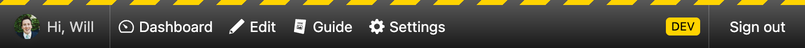

# Admin Bar Component



Admin Bar Component is a web component that is built with [Lit](https://lit.dev). It can be added to projects that can load web components (vanilla JavaScript and most modern frameworks) and it is customizable so you can choose what buttons are displayed, and you can style it to match your brand or website’s look and feel.

- 👋 Show an avatar and a greeting to confirm the currently logged-in user.
- 🚧 A customizable environment warning can be shown to let users know they are not on production.
- 🎛️ Buttons are customizable and can link to a URL or trigger JavaScript events.
- 🚪 A dedicated logout button gives users a way to sign out of your app.

> [!NOTE]
> Admin Bar Component is still in development. Things might change and break until the 1.0.0 release.

## Installation

To install Admin Bar Component, use NPM or a compatible package manager.

### With NPM:

```bash
npm install admin-bar-component --save-dev
```

## Setup

This package includes a JavaScript file that registers web components when you import it into a file or load it with a `<script type="module">` tag.

It also includes a CSS file that can be imported into your project’s CSS or loaded onto the page in a `<link>` tag.

### Setup Examples


- [Stackblitz – Theme Examples](https://stackblitz.com/edit/vitejs-vite-gxbmja?file=index.html)
- [Stackblitz – Vite + Vanilla JS](https://stackblitz.com/edit/vitejs-vite-ckpby6?file=index.html)
- [Stackblitz – Vite + Vue.js 3](https://stackblitz.com/edit/vitejs-vite-gb3byy?file=vite.config.js)

### To add Admin Bar Component to an HTML page, follow these instructions:

1. Add the stylesheet in your `<head>` tag:
   ```html
   <link rel="stylesheet" href="path-to-your-assets/admin-bar.css" />
   ```
1. Add the JavaScript file wherever you load your scripts:
   ```html
   <script type="module" src="path-to-your-assets/admin-bar.js"></script>
   ```
1. Add and configure an `<admin-bar>` element:
   ```html
   <admin-bar></admin-bar>
   ```
1. Add buttons into your `<admin-bar>` element:
   ```html
   <admin-bar>
     <admin-bar-button></admin-bar-button>
   </admin-bar>
   ```

### To add Admin Bar Component to a project with a build tool, like Vite, follow these instructions:

1. In a global JavaScript file or in a specific layout or component file, you can import the JavaScript file like this:
   ```javascript
   import 'admin-bar-component'
   ```
1. You can load the CSS in your component file, as well, by importing the file directly:
   ```javascript
   import 'admin-bar-component'
   import 'admin-bar-component/dist/admin-bar.css'
   ```
2. Or, if you are using something like PostCSS, you can import the CSS file into your CSS file, like this:
   ```postcss
   @import url(admin-bar-component/dist/admin-bar.css);
   ```

Depending on what bundler or framework you are using, you may need to add loaders or register the web component as a custom element (telling the framework not to try to render it).

## Customizing Admin Bar

All of the features on the `<admin-bar>` element are opt-in by using attributes and slots.

For example, you can add a greeting message by adding the `show-greeting` attribute:
```html
<admin-bar show-greeting></admin-bar>
```

By default, this will say "Hello", but you can change the message by adding your own text or element into the `greeting` slot:
```html
<admin-bar show-greeting>
  <div slot="greeting">Hello, Sam</div>
</admin-bar>
```

Now your custom text will appear. If you would also like to add an avatar next to your message you can use the `avatar-src` and `avatar-alt` attributes:
```html
<admin-bar show-greeting avatar-src="path-to-your-assets/user-photo.jpg" avatar-atr="Sam’s avatar">
  <div slot="greeting">Hello, Sam</div>
</admin-bar>
```

> [!NOTE]
> If `show-greeting` is removed, the avatar image and the content in the `greeting` slot will no longer be rendered.

### Admin Bar Public Properties

| Attribute Name     | Type      | Default                       | Description                                                                                           |
|--------------------|-----------|-------------------------------|-------------------------------------------------------------------------------------------------------|
| `avatar-alt`       | _string_  | `'Avatar of logged in user.'` | Sets the alt text on an avatar image.                                                                 |
| `avatar-src`       | _string_  | `undefined`                   | Sets the `src` on an avatar image and enables the avatar image to be displayed.                       |
| `greeting-text`    | _string_  | `'Hello'`                     | Sets the greeting text content.                                                                       |
| `logout-href`      | _string_  | `'#'`                         | A URL added to the default logout button, when `show-logout` is added to an `<admin-bar>`.            |
| `logout-label`     | _string_  | `'Sign out'`                  | The label of the default logout button.                                                               |
| `show-environment` | _boolean_ | `false`                       | Displays the environment warning, letting users know what environment they are currently logged into. |
| `show-greeting`    | _boolean_ | `false`                       | Displays the avatar and greeting message.                                                             |
| `show-logout`      | _boolean_ | `false`                       | Displays the default logout button or content added to the `logout` slot.                             |

### Admin Bar Slots

| Slot Name  | Description                                                                                                                                                                                                                                                               |
|------------|---------------------------------------------------------------------------------------------------------------------------------------------------------------------------------------------------------------------------------------------------------------------------|
| `default`  | The `default` slot is where you would place `<admin-bar-button>` elements, but it can also be used for other elements. All children in the `default` slot will be laid out by CSS Flexbox and the contents will horizontally scroll when it gets too wide.                |
| `greeting` | This slot is meant to let the logged-in user verify they are logged in, but any HTML or text can appear in the `greeting` slot.                                                                                                                                           |
| `logout`   | When `show-logout` is set, a default logout button will be rendered, using the `logout-href` and `logout-label` attributes. Adding elements into the `logout` slot will repace the default logout button, allowing you to use your own `<admin-bar-button>` in its place. |

## Customizing Add Admin Bar Buttons

Admin Bar Buttons are child web components that render either an `<a>` element or a `<button>` element—depending on the options you pass through.

To create an `<a>` element that links to a URL, you can add a label and a `button-href` attribute that includes your URL:
```html
<admin-bar-button button-href="https://myexample.com" label-text="My Link Label"></admin-bar-button>
```

To create a `<button>` element with JavaScript click event, you can leave off the `button-href` and the component will switch over to a button element:
```html
<admin-bar-button onclick="myEventHandlerMethod" label-text="My Button Label"></admin-bar-button>
```

To differentiate your buttons, `<svg>` or `` icons can be added to either the `label-before` or `label-after` slots:
```html
<admin-bar-button onclick="myEventHandlerMethod" label-text="My Button Label"><span slot="label-before"><svg <!-- SVG code --> ></svg></span></admin-bar-button>
```

### Admin Bar Button Public Properties

| Attribute Name  | Type      | Default     | Description                                                                                                                  |
|-----------------|-----------|-------------|------------------------------------------------------------------------------------------------------------------------------|
| `button-href`   | _string_  | `undefined` | Adding the `button-href` turns the `<admin-bar-button>` into an `<a>` elements and sets this string as its `href` attribute. |
| `label-text`    | _string_  | `''`        | Sets the label for the `<admin-bar-button>`.                                                                                 |
| `logout-button` | _boolean_ | `false`     | Styles the button like the default logout button.                                                                            |

### Admin Bar Button Slots

| Slot Name      | Description                                                                    |
|----------------|--------------------------------------------------------------------------------|
| `after-label`  | Adds content after the label. This can be used for icons or other indicators.  |
| `before-label` | Adds content before the label. This can be used for icons or other indicators. |
| `default`      | Adding text or elements into the `default` slot replaces the `label-text`.     |

### Replacing the Default Logout Button

You may have a situation where you need to replace the default logout button to—for example—a button that fires a JavaScript action. Starting with this code as an example, you can do the following:
```html
<admin-bar show-logout logout-href="/logout" logout-label="Log off"></admin-bar>
```

1. Add an `<admin-bar-button>` into the `default` slot of your `<admin-bar>`
   ```html
   <admin-bar show-logout logout-href="/logout" logout-label="Log off">
     <admin-bar-button></admin-bar-button>
   </admin-bar>
   ```
1. Add `slot="logout"` to the `<admin-bar-button>`. Add the `logout-button` attribute to style the button with the styles from the default logout button.
   ```html
   <admin-bar show-logout logout-href="/logout" logout-label="Log off">
     <admin-bar-button slot="logout" logout-button></admin-bar-button>
   </admin-bar>
   ```
1. If you are using vanilla JavaScript you can use an `onclick` attribute to fire your logout script on click. If you are using a compatible framework, you can change `onclick` to the syntax used for click directives.
   ```html
   <admin-bar show-logout logout-href="/logout" logout-label="Log off">
     <admin-bar-button onclick="handleLogoutMethod" slot="logout" logout-button></admin-bar-button>
   </admin-bar>
   ```
1. This replaces the original logout buttons, so you no longer need the `logout-href` and `logout-label` attributes. You still need the `show-logout` attribute to render the logout slot.
   ```html
   <admin-bar show-logout>
     <admin-bar-button onclick="handleLogoutMethod" slot="logout" logout-button></admin-bar-button>
   </admin-bar>
   ```

## Adding Simple Text to Admin Bar

The default slot of an `<admin-bar>` element is an element with `display: flex` on it. This means you can add `<admin-bar-button>` elements alongside any other HTML element you would like display next to them. You can add a `<div>` with text in it and use CSS to style it however you'd like, however, if you would simply like to display some text, you could use a `<admin-bar-text>` element:

```html
<admin-bar>
  <admin-bar-text text-content="Hello, World!"></admin-bar-text>
</admin-bar>
```

Using the `text-content` attribute will add plain text that is styled to look like the text in Admin Bar’s greeting. If you would like to style the text differently or if you would like to add your own HTML elements into the `<admin-bar-text>` element, you can use the default slot to add elements:

```html
<admin-bar>
  <admin-bar-text>Hello, World!</admin-bar-text>
</admin-bar>
```

### Adding Chips to Admin Bar Text Elements

You can use `<admin-bar-text>` elements for notes or for other useful information that is tied to the context of the current page you are on. Using the `chip-content` attribute on a `<admin-bar-text>` element will let you call out stats and other information:

```html
<admin-bar>
  <admin-bar-text chip-content="25" text-content="Enries in this Section"></admin-bar-text>
</admin-bar>
```

If you would like to create a label that is made up of only a chip, you can omit the default slot and the `text-content` attribute:

```html
<admin-bar show-environment>
  <admin-bar-text chip-content="STAGING"></admin-bar-text>
</admin-bar>
```

> [!TIP]
> The color of chips can be styled using CSS Custom Properties.

## Styling Admin Bar

Admin Bar Component is a web component that renders via the Shadow DOM. This means that Admin Bar Component won’t pick up the styles from your project’s stylesheets, but it also means that you cannot directly style children in the `<admin-bar>` and `<admin-bar-button>` components.

> [!NOTE]
> Slot content is an exception. They will pick up some styles from the web component CSS, but you can also use CSS to style them in your stylesheet.

Classes, CSS Cascade Layers, CSS Custom Properties can be used to customize the look of your Admin Bar.

### Top-Level Classes

Classes can be added to `<admin-bar>` elements to change the look and placement of the element on your page.

| Class    | Description                                                                                                                                                                                                                       |
|----------|-----------------------------------------------------------------------------------------------------------------------------------------------------------------------------------------------------------------------------------|
| `bottom` | Works along side the `fixed` or `sticky` class to move the `<admin-bar>` to the bottom of the page (sets the `bottom` CSS property to `0` and the `top` to `auto`).                                                               |
| `fixed`  | Makes the `<admin-bar>` fixed to the top of the page, using CSS `position: fixed`. When using `fixed` you can move `<admin-bar>` to the bottom of your `<body>` element.                                                          |
| `rtl`    | Changes the reading direction from `ltr` to `rtl` in situations where you need to manually set it. Admin Bar Component will automatcally switch to RTL if your page is set to RTL or if you have the CSS set to `direction: rtl`. |
| `sticky` | Makes the `<admin-bar>` stick to the top of the page, using CSS `position: sticky` when the `<admin-bar>` is above the rest of the content on the page.                                                                           |

> [!NOTE]
> The `fixed` and `sticky` classes are there to make setting the position easy, however, instead of using those classes, you could style the `admin-bar` element position in your CSS.
---

Currently, there are no classes that can be added to `<admin-bar-button>` elements.

### CSS Cascade Layers

Linking or importing the `admin-bar.css` into your project sets default CSS Custom Property values. The CSS in this file is added to a [CSS Cascade Layer](https://developer.mozilla.org/en-US/docs/Learn/CSS/Building_blocks/Cascade_layers), called `admin-bar`.

If you are using CSS Cascade Layers in your project you can add the `admin-bar` layer to your layer stack and then override it with another layer:

```css
@layer reset, third-party, admin-bar, theme, layout, utilities;
@layer theme {
    admin-bar {
        /* Styles go here, for example: */
        --admin-bar-bg: #DA00FD8C;
    }
}
```

If you are not using CSS Cascade Layers, you can override styles without the layer at-rule, because unlayered styles have more specificity:

```css
admin-bar {
    /* Styles go here, for example: */
    --admin-bar-bg: rgba(52, 215, 0, 0.5);
}
```

### CSS Custom Properties

The `admin-bar.css` file has comments describing what each CSS Custom Property styles. The contents of that file can be found here:

```css
/* Added styles to CSS Cascade Layer to make it easier to override them. */
@layer admin-bar {
   admin-bar {
      /* Sets the background of the bar using the background shorthand property,
      allowing you to use a gradient, a solid color, or an image. */
      --admin-bar-bg: linear-gradient(to bottom, rgba(0 0 0 / 0.65), rgba(0 0 0 / 0.9));

      /* Adds an effect to blur */
      --admin-bar-backdrop-filter: blur(20px) saturate(200%);

      /* The color used on hover changes. */
      --admin-bar-color-highlight: oklch(0.6 0.4 83);

      /* The highlight color specific to logout buttons. That can be set to
      a different color to make it more obvious that the logout button is not a link. */
      --admin-bar-color-highlight-logout: var(--admin-bar-color-highlight);

      /* The color of text for everything but button labels.. */
      --admin-bar-color-text: rgba(255 255 255 / 0.8);

      /* The font stack for all text. */
      --admin-bar-font-stack: system-ui, sans-serif;

      /* The font size for all text. */
      --admin-bar-font-size: .9rem;

      /* The height and width of avatar images. */
      --admin-bar-avatar-size: 25px;

      /* The height of the bar and all of the buttons. */
      --admin-bar-height: 43px;

      /* When `show-environment` is added to an `<admin-bar>` an environment
      warning will appear. The default looks like yellow, striped police tape,
      but you can use any CSS value used in the background shorthand property. */
      --admin-bar-environment-bg: repeating-linear-gradient(
              -45deg,
              var(--admin-bar-environment-bg-color),
              var(--admin-bar-environment-bg-color) 18px,
              transparent 18px,
              transparent 30px
      );

      /* Change just the color of the yellow stripes in the environment warning. */
      --admin-bar-environment-bg-color: oklch(0.9 0.4 98);

      /* The height of the environment warning */
      --admin-bar-environment-height: 5px;

      /* The default transition duration for all animations.
      Set this to `0` to turn off transitions. */
      --admin-bar-transition-duration: 0.3s;

      /* Adds a box-shadow to the bar to increase visual elevation. */
      /*--admin-bar-shadow: 0 0 15px color-mix(in srgb, rgba(0, 0, 0, 0.7), currentColor 10%);*/

      /* Adds a box-shadow to avatar images and buttons. */
      --admin-bar-shadow-elements: 0 1px 2px color-mix(in srgb, rgba(0 0 0 / 0.5), currentColor 10%), 0 3px 6px color-mix(in srgb, rgba(0 0 0 / 0.4), currentColor 10%);

      /* By default, when adding the `fixed` or `sticky` class to an `<admin-bar>`,
       the z-index of the element is set to `1`. Set this property if you need the
       z-index to be a higher value. */
      /*--admin-bar-z-index: 1;*/

      /* The background of all buttons. */
      --admin-bar-button-color-bg: transparent;

      /* The background of the button that is currently in the hover state. */
      --admin-bar-button-color-bg-hover: var(--admin-bar-button-color-text, white);

      /* The text of all button labels. */
      --admin-bar-button-color-text: rgb(255 255 255);

      /* The background for chips in `admin-bar-text` components. */
      --admin-bar-chip-color-bg: rgba(255 255 255 / 0.9);

      /* The text for chips in `admin-bar-text` components. */
      --admin-bar-chip-color-text: rgba(0 0 0 / 1);

      /* ====================================================================== */

      /* Default styles for the `<admin-bar>` element. */
      --environment-height: 0px;
      display: block;
      width: var(--admin-bar-width, 100%);
      height: calc(var(--admin-bar-height, 43px) + var(--environment-height));

      /* Add height when environment warning is enabled. */
      &[show-environment] {
         --environment-height: var(--admin-bar-environment-height);
      }
      /* Set read direction from right to left. */
      &.rtl {
         direction: rtl;
      }
      /* Fixes `<admin-bar>` to the top of page. */
      &.fixed {
         position: fixed;
         right: 0;
         left: 0;
         z-index: var(--admin-bar-z-index, 1);

         &:not(.bottom) {
            top: 0;
         }
      }
      /* Sticks `<admin-bar>` to the top of the page when scrolling. */
      &.sticky {
         position: sticky;
         right: 0;
         left: 0;
         z-index: var(--admin-bar-z-index, 1);

         &:not(.bottom) {
            top: 0;
         }
      }
      /* Moves `<admin-bar>` to the bottom of the page when using `.fixed` or `.sticky`. */
      &.bottom {
         right: 0;
         bottom: 0;
         left: 0;
      }

      /* Avoid layout shift from happening before Admin Bar Component is registered. */
      &:not(:defined) {
         background: var(--admin-bar-bg);
         opacity: 0.75;

         /* Hide all slot content until Admin Bar Component is registered. */
         & * {
            display: none;
         }
      }
   }

   @media (prefers-reduced-motion) {
      admin-bar {
         /* Turns off transitions for users who do not want any animations. */
         --admin-bar-transition-duration: 0s;
      }
   }
}
```

## Contributing
This project is new and it will evolve as it grows (including adding CI automation, tests, and checks). For now, if you run into any bugs, please [leave an issue on GitHub](https://github.com/wbrowar/admin-bar-component/issues).

If you would like to contribute changes to the project, please do the following:
1. Fork the branch you would like to start with (usually `main`).
2. Set up the project locally (using the Node version described in the `.nvmrc` file in the root).
3. Make your changes.
4. Run `npm run test` to run type checking and to run tests.
5. Push your branch up and make a [create a pull request on GitHub](https://github.com/wbrowar/admin-bar-component/pulls).

Not all pull requests will be pulled in and not all issues will get fixed, but all suggestions are welcomed.
